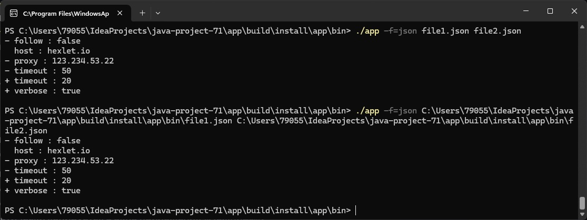
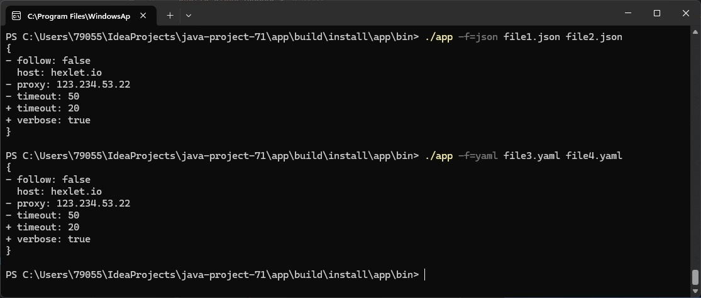
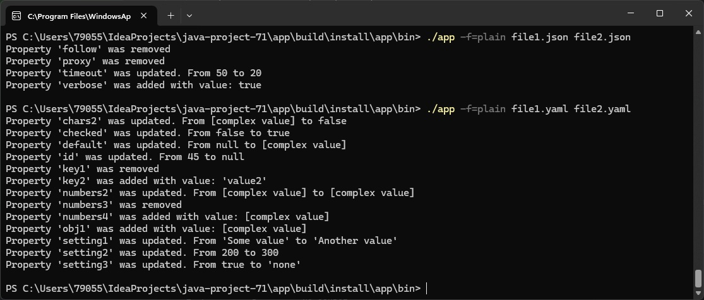

### Hexlet tests and linter status:

### Maintainability and Test coverage:

# Вычислитель отличий
## Описание
**Вычислитель отличий** – программа, определяющая разницу между двумя структурами данных.

Возможности утилиты:

* Поддержка разных входных форматов: yaml и json
* Генерация отчета в виде plain text, stylish и json

